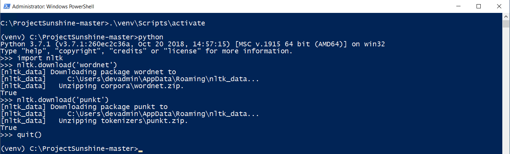
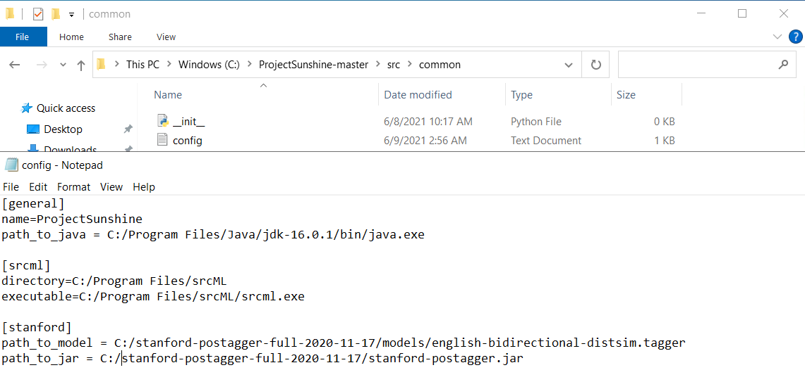
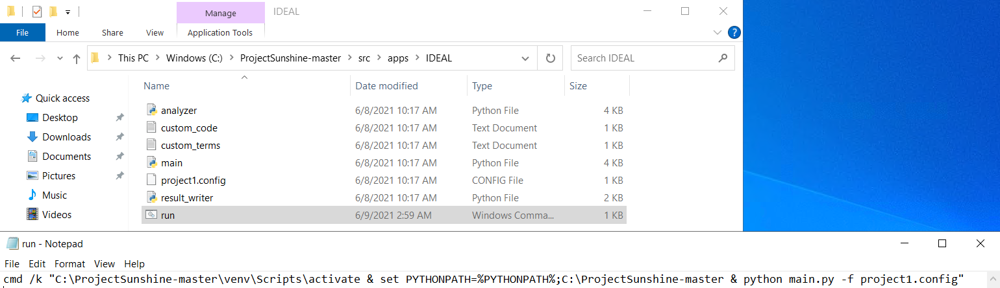
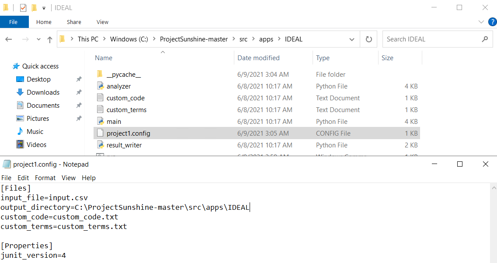
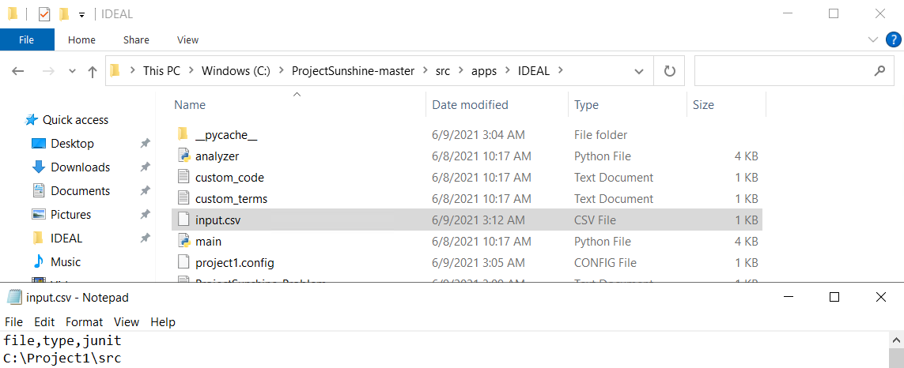
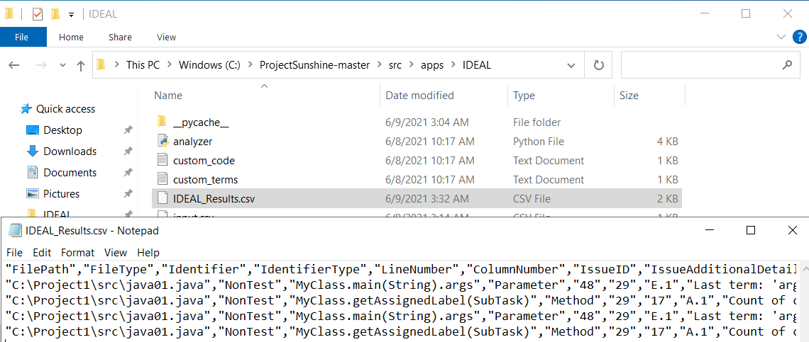

# IDEAL

#### _An Open-Source Identifier Name Appraisal Tool_

Here is our customized version of IDEAL, which, in addition to its basic features, provides the ability to detect linguistic antipatterns in Python files. The types of linguistic antipatterns that can be identified through the analysis of the Python language are:

- Not implemented Condition: The comments of a method suggest a conditional behaviour that is not implemented in the code. When the implementation is default this should be documented.
- Attribute Singature and Comment are Opposite: The declaration of an attribute contradicts its documentation.
- Method Signature and Comment are Opposite: The declaration of a method is in contradiction with its documentation.

## Usage

	
<b>Docker (recommended)</b>

	 
	<ol>
		<li>Clone the repository</li>
		<li>
		Build the Dockerfile 
		<code>docker build . -t ideal</code>
		</li>
		<li>
        Provide the files you wish to analyze in the file <i>src/apps/IDEAL/input.csv</i> 
        The files you want to analyze should be located in the project's folder or in a mounted volume.
        The container path <i>/app</i> contains the project's root
        </li>
        <li>
        Run the container and mount the root folder to use files from the host directly in the container 
        <b>Windows: </b><code>docker run -v "%cd%":/app -it ideal</code> 
        <b>Linux: </b><code>docker run -v ./:/app -it ideal</code>
        </li>
    </ol>
  The image is also available on DockerHub <a href="https://hub.docker.com/r/xrenegade100/ideal">at this link</a>.

  
<b>Manual Installation</b>

  Note: The following steps have been verified on a Windows 10 operating system.
  
  ### Prerequisites
1. Install [Git](https://git-scm.com/download/win)
2. Install [Java JDK](https://www.oracle.com/java/technologies/javase-jdk16-downloads.html)
3. Install [Python 3.7.1](https://www.python.org/downloads/release/python-371/)
4. Install [srcML 1.0.0](https://www.srcml.org/#download)
5. Download [Stanford JARs 4.2.0](https://nlp.stanford.edu/software/tagger.shtml#Download)
  
  ### Setup IDEAL
  <ol>
  <li>
  Clone the repository
  </li>
  <li>
  Install virtual environment: <code>py -m pip install --user virtualenv</code>
  </li>
  <li>
  Create virtual environment: <code>py -m venv venv</code>
  </li>
  <li>
  Activate virtual environment: <code>.\venv\Script\activate</code>
  </li>
  <li>
  Install packages from requirements files: <code>py -m pip install -r requirements.txt</code>
  </li>
  <li>
  Download NLTK data. Enter the following commands:
  <ol>
  <li><code>python</code></li>
  <li><code>import nltk</code></li>
  <li><code>nltk.download('wordnet')</code></li>
  <li><code>nltk.download('punkt')</code></li>
  <li><code>quit()</code></li>
  </ol> 
  
  </li>
  <li>Update all paaths in config file:  <i>src/common/config.txt</i> 
  
  </li>
  </ol>

### Configure and Run IDEAL For Project

<ol>
  <li>
  Update all paths in the run command file: <i>src/apps/IDEALrun.cmd</i> 
  
  </li>
  <li>
  Update all paths in the project config file: <i>src/apps/IDEAL/project1.config</i> 
  
  </li>
  <li>
  Create <i>input.csv</i> file and add paths to the source code <i>files/directories</i> 
  
  </li>
  <li>Move into <i>src/apps/IDEAL</i> and run:
   <ol>
      <li><b>Windows:</b> <i>run.cmd</i></li>
      <li><b>Linux:</b> <i>run.sh</i></li>
   </ol>
  <li>See the results of analysis in the file: <i>src/apps/IDEAL/IDEAL_Results.csv</i> 
  
  </li>
  </ol>

### Abstract

Developers must comprehend the code they will maintain, meaning that the code must be legible and reasonably
self-descriptive. Unfortunately, there is still a lack of research and tooling that supports developers in understanding
their naming practices; whether the names they choose make sense, whether they are consistent, and whether they convey
the information required of them. In this paper, we present IDEAL, a tool that will provide feedback to developers about
their identifier naming practices. Among its planned features, it will support linguistic anti-pattern detection, which
is what will be discussed in this paper. IDEAL is designed to, and will, be extended to cover further anti-patterns,
naming structures, and practices in the near future. IDEAL is open-source and publicly available, with a demo video
available at: [https://youtu.be/fVoOYGe50zg](https://youtu.be/fVoOYGe50zg)

### Evaluation Results

The results of our evaluation of IDEAL is available [here](https://drive.google.com/drive/folders/183J3_4xIdA3Xy762ryLrr0MVJbD5Oz8D).

### Naming Violation Examples

Examples of naming violations currently detected by IDEAL are available [here](documentation/IDEAL/NamingViolationExamples.md).

### IDEAL Architecture

Details around the architecture of IDEAL is available [here](documentation/IDEAL/Architecture.md).

### Naming Violations

- ### [Arnaoudova et al.](documentaion/IDEAL/AntiPatternRules_Arnaoudova.md)
- ### [SCANL](documentaion/IDEAL/AntiPatternRules_SCANL.md)

### Cite IDEAL

If you are using IDEAL in your research, please cite the following paper:

> Anthony Peruma, Venera Arnaoudova, and Christian D. Newman, "IDEAL: An Open-Source Identifier Name Appraisal Tool," 37th IEEE International Conference on Software Maintenance and Evolution (ICSME 2021), Luxembourg City, Luxembourg, September 27 - October 1, 2021.
